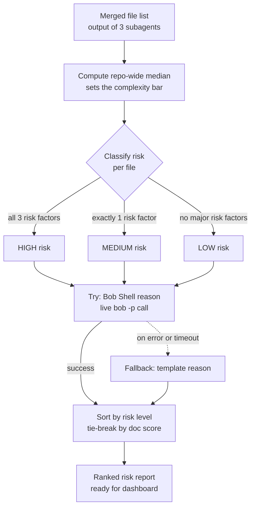

# Backend — Orchestrator

`orchestrator.py` merges the three subagents' output into one ranked
bus-factor risk report.

## Risk classification
- **HIGH**: ≤2 contributors, complexity above repo median, doc score < 40
- **MEDIUM**: ≤2 contributors, exactly one of the above true
- **LOW**: everything else

## Reason generation
`generate_reason_llm()` calls Bob Shell (`bob -p`) at runtime for a natural
one-sentence explanation. Falls back to a template if Bob errors or times
out (15s), so the pipeline never breaks mid-run.